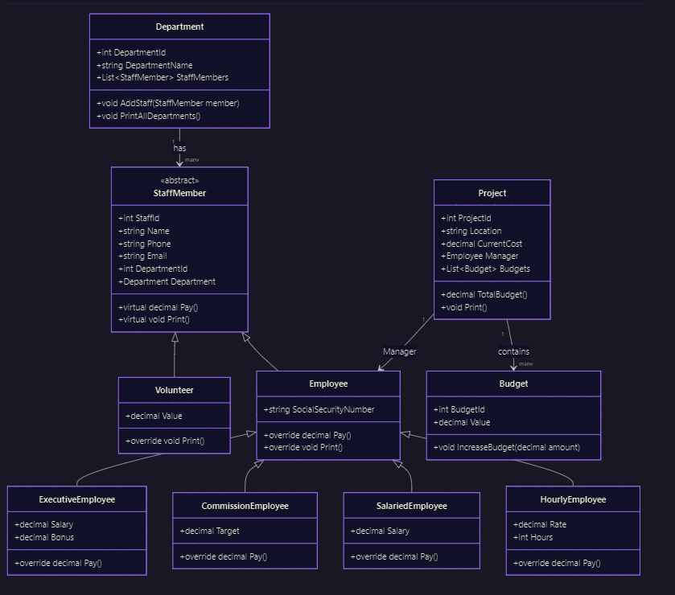

# Employee Management System

## 📌 Overview

The **Employee Management System** is a structured project designed to manage employees, departments, and projects in an organization.
It combines **database concepts** and **object-oriented programming (OOP) principles**, including inheritance, polymorphism, and abstraction.

The system also sets the foundation for applying advanced concepts such as **SOLID principles** and **Design Patterns**, which will be integrated in future iterations.

---

## 🛠️ Core Features

* **Department Management**: Departments hold multiple staff members.
* **Staff Management**: Abstract base class `StaffMember` defines shared attributes and behaviors.
* **Employee Types**: Supports multiple employee models:

  * ExecutiveEmployee
  * CommissionEmployee
  * SalariedEmployee
  * HourlyEmployee
* **Volunteer Support**: Non-paid staff members represented with `Volunteer`.
* **Project Management**: Each project has a manager and can contain multiple budgets.
* **Budget Tracking**: Projects can increase or calculate total budget dynamically.

---

## 📂 Class Design

The system is modeled with an **object-oriented class structure**:

* **Department**

  * Holds `DepartmentId`, `DepartmentName`, and a list of staff members.
  * Methods: Add staff, print all departments.

* **StaffMember (Abstract)**

  * Base class for all staff-related types.
  * Defines `Pay()` and `Print()` as virtual/abstract methods.

* **Employee (Concrete)**

  * Extends `StaffMember` with `SocialSecurityNumber`.
  * Overridden `Pay()` and `Print()` implementations.
  * Specializations:

    * `ExecutiveEmployee` → Salary + Bonus.
    * `CommissionEmployee` → Target-based pay.
    * `SalariedEmployee` → Fixed salary.
    * `HourlyEmployee` → Hourly rate × hours worked.

* **Volunteer**

  * Extends `StaffMember`.
  * Non-paid, holds a `Value` contribution field.

* **Project**

  * Contains `ProjectId`, `Location`, `CurrentCost`, and a manager (Employee).
  * Holds multiple budgets.
  * Methods: Calculate total budget, print details.

* **Budget**

  * Defines `BudgetId`, `Value`.
  * Method to increase budget by a given amount.

 

---

## 🔗 ERD & Class Diagram

### Entity-Relationship Diagram (ERD)

* A **Department** has many **StaffMembers**.
* A **StaffMember** may be an **Employee** or **Volunteer**.
* An **Employee** can manage multiple **Projects**.
* A **Project** contains many **Budgets**.

### Class Diagram (as provided)

The UML class diagram illustrates:

* Inheritance hierarchy between `StaffMember`, `Employee`, and specialized employee types.
* Association between `Department` and `StaffMember`.
* Association between `Project` and `Employee` (as manager).
* Aggregation of `Project` and `Budget`.

---

## 🚀 Future Enhancements

Planned improvements include:

* Full implementation of **CRUD operations** for Departments, Employees, and Projects.
* Business logic validation (e.g., budget constraints, project manager limits).
* Integration with **SQL Server backend** for persistent storage.
* Applying **SOLID principles** for clean, maintainable architecture.
* Incorporating **Design Patterns** such as Repository, Factory, and Strategy.
* User-friendly frontend integration with **C#/.NET** or **Node.js/React**.

---

## 📚 Learning Goals

This project supports my learning in:

* **Database Design & ERD Modeling**.
* **Object-Oriented Programming** (Inheritance, Abstraction, Polymorphism).
* Applying **SOLID Principles** for scalable system design.
* Exploring **Design Patterns** to improve flexibility and maintainability.
* Building **enterprise-level applications** with both backend and frontend layers.

---

## 📅 Status

* ✅ ERD & Class Diagrams completed.
* ✅ Database schema designed.
* ✅ Initial object-oriented model implemented.
* 🔜 CRUD operations.
* 🔜 Applying SOLID & Design Patterns.
* 🔜 Backend + UI integration.

---

## 🤝 Contribution

This project is a **learning-driven initiative**. Contributions, suggestions, and feedback about design, OOP principles, and best practices are always welcome.

---

## 📄 License

This project is open-source under the MIT License.
