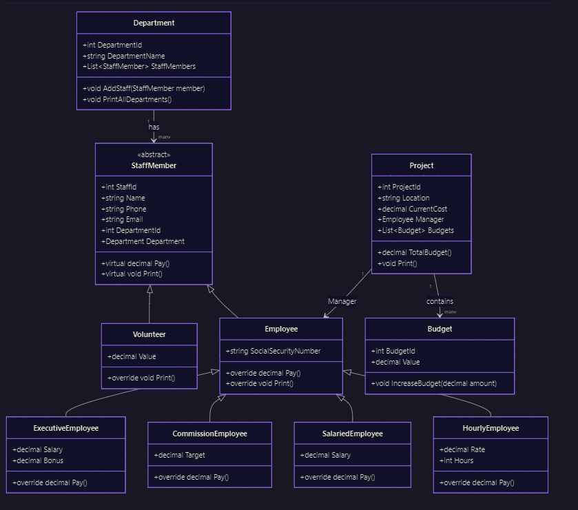

# Employee Management System

## 📌 Overview

The **Employee Management System** is a structured project designed to manage employees, departments, and projects.
It brings together **database design** and **object-oriented programming (OOP) concepts**, serving as a hands-on learning project.

---

## 🛠️ Features

* Manage **Departments** and their staff members.
* Manage **Employees** with different types (Executive, Commission, Salaried, Hourly).
* Support **Volunteers** as non-paid contributors.
* Manage **Projects**, each assigned to a manager and containing multiple budgets.
* Track **Budgets** and calculate total project costs.

---

## 📂 Class Design (Conceptual)

* **Department** manages staff lists.
* **StaffMember** is an abstract base class for all staff.
* **Employee** extends staff with payroll functionality.

  * ExecutiveEmployee
  * CommissionEmployee
  * SalariedEmployee
  * HourlyEmployee
* **Volunteer** extends staff without salary.
* **Project** links to a manager and contains budgets.
* **Budget** supports increasing and tracking values.

---
## 🔗 ERD  

* A Department has many StaffMembers.
* A StaffMember may be an Employee or Volunteer.
* An Employee may be (Salary, Commisstion, Hourly, Executive)
* An Employee can manage multiple Projects.
* A Project contains many Budgets.

## 🎓 What I Have Learned So Far

This project helped me strengthen both my **OOP** and **Database** knowledge:

### Object-Oriented Programming

* **Inheritance** → Created a hierarchy of staff and employee types.
* **Polymorphism** → Overridden methods like `Pay()` and `Print()` across subclasses.
* **Data Abstraction** → Used abstract classes and methods for common behaviors.
* **Encapsulation** → Grouped related data and methods into cohesive classes.

### Databases & Data Access

* **SQL** → Designed tables, constraints, and relationships.
* **Stored Procedures** → Used to handle CRUD operations more securely and efficiently.
* **ADO.NET** → Connected C# code with SQL Server for database interaction.

---

## 🚀 Future Learning Goals

I have **not yet learned** the following but will focus on them next:

* **SOLID Principles** → For building maintainable and scalable architecture.
* **Design Patterns** → To solve recurring design problems elegantly.

After I learn them, I will **refactor the project** to apply best practices and improve the design.

---

## 📅 Project Status

* ✅ ERD & Class Diagrams completed.
* ✅ Implemented OOP structure (Inheritance, Polymorphism, etc.).
* ✅ Basic SQL schema and Stored Procedures.
* ✅ Integrated database with **ADO.NET**.
* 🔜 Apply SOLID & Design Patterns.
* 🔜 Refactor and extend functionalities.

